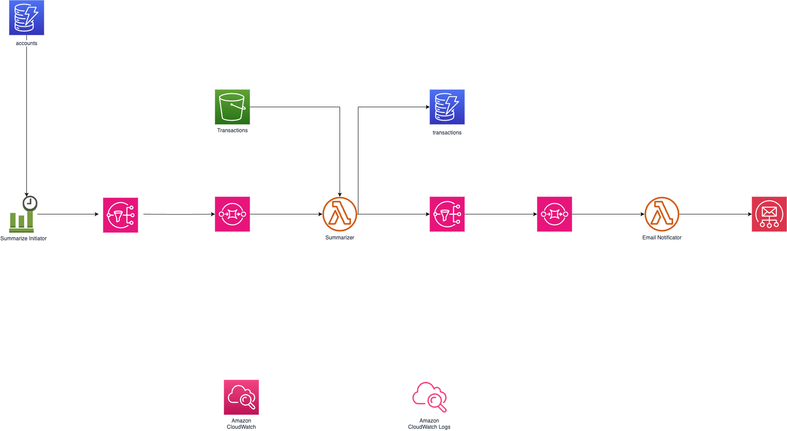
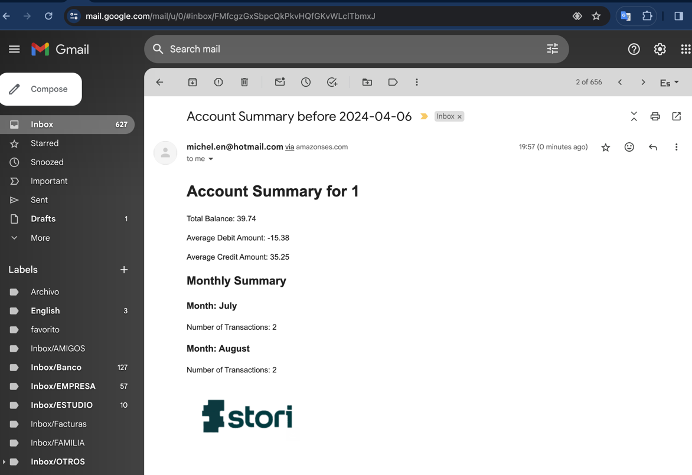

# stori
The Transaction Summary Reporter

## Requirements
- Python 3.6 or higher
- pip
- pulumi
- AWS account credentials "~/.aws/credentials"
- docker
- docker-compose
- git
- make
- npm
- for local is required env 
  * LOCALSTACK_AUTH_TOKEN

## Architecture
The architecture of the application is based on the following components:


## Installation
To install the application, follow the steps below:
With the requirements installed, run the make help command to see the available commands.

* The email address must be subscribed to the SES 
service to receive the emails that process is done on infrastructure/index.ts


```bash
make help
```

## Email Format
